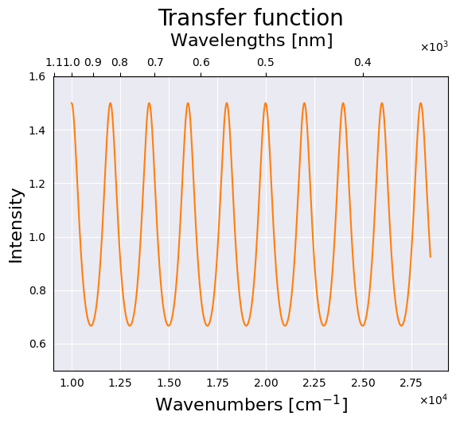
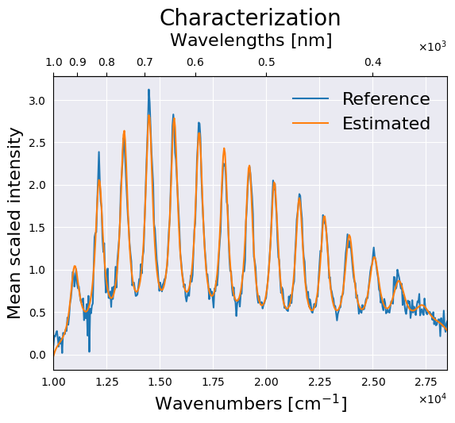
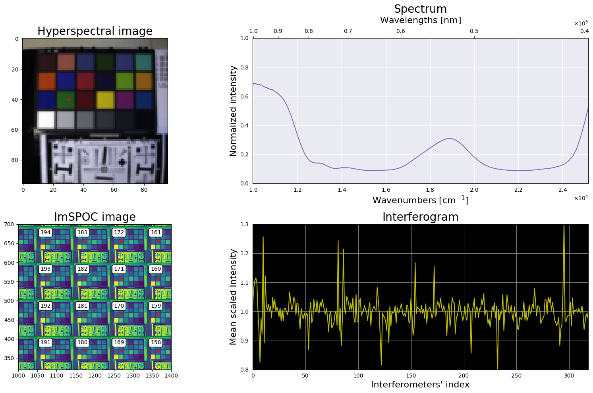

# IRCA

[](https://zenodo.org/badge/latestdoi/614794669)

Python library for the interferometer response characterization algorithm (IRCA), containing a set of utilities for estimating the parametric transmittance response of Fabry-Perot interferometers, with particular attention to multi-aperture imaging spectrometers based on that technology.
Main functionalities:
- Modeling the optical trasmittance response of a Fabry-Perot interferometer
- Characterizing that transmittance response their sampled version
- Simulating the acquisition of a multi-aperture interferometric imaging spectrometer from a hyperspectral image

## Demonstration scripts

This repository provides three Jupyter notebooks associated to the main functionalities of the library:

### Model:
- Demo: `jupyter notebook ./notebooks/model.ipynb`
- Shows the effect of modifying parameters on the Fabry-Perot transmittance response
- Provides an interactive tool to manually fit the curve to a reference



### Characterization:
- Demo: `jupyter notebook ./notebooks/characterization.ipynb`
- Loads the characterization options for the IRCA proposed method
- Estimates the parameters of the transfer function for each interferometer
- Visualizes the parameters and compares the result with the training acquisitions



### Simulator:
- Demo: `jupyter notebook ./notebooks/characterization.ipynb`
- Loads a conventional hyperspectral image and the characterization of the inteferometric device
- Simulates an acquisition obtained by a device with those characteristics



## Project Structure

    ├── data                        <- Data folder
    │   ├── acquisitions            <- Sample raw acquisitions from Image SPectrometer On Chip (ImSPOC)
    │   ├── assets                  <- Web assets for this document
    │   ├── characterization        <- Characterization options and parameters
    │   ├── device                  <- Device information
    │   └── hyperspectral           <- Sample hyperspectral image
    │
    ├── notebooks                   <- Jupyter notebooks interactive demo scripts
    │   ├── characterization.ipynb  <- Characterization demo script
    │   ├── model.ipynb             <- Interferometry model demo script
    │   └── simulator.ipynb         <- Simulator demo script
    │
    └── src                         <- Source code folder
        ├── characterization        <- Characterization module
        ├── demo                    <- Demo scripts
        ├── inversion               <- Interface scripts
        └── lib                     <- General custom library module


## Requirements

- Python v3.8+
- NumPy: https://numpy.org/
- SciPy: https://scipy.org/
- Matplotlib: https://matplotlib.org/
- Pydantic: https://docs.pydantic.dev/
- Jupyter Notebook: https://jupyter.org/

To install the requirements:
- `pip install -r requirements.txt`

## Citation
To use this code, please cite:

```
@article{picone2023irca,
  title     = {Interferometer response characterization algorithm for multi-aperture {Fabry-Perot} imaging spectrometers},
  author    = {Picone, Daniele and Gousset, Silv{\'e}re and Dalla Mura, Mauro and Ferrec, Yann and le Coarer, Etienne},
  journal   = {Optics Express},
  publisher = {Optica Publishing Group},
  year      = {2023},
  note      = {In press},
  doi       = {https://doi.org/10.1364/OE.491698},
}
```
